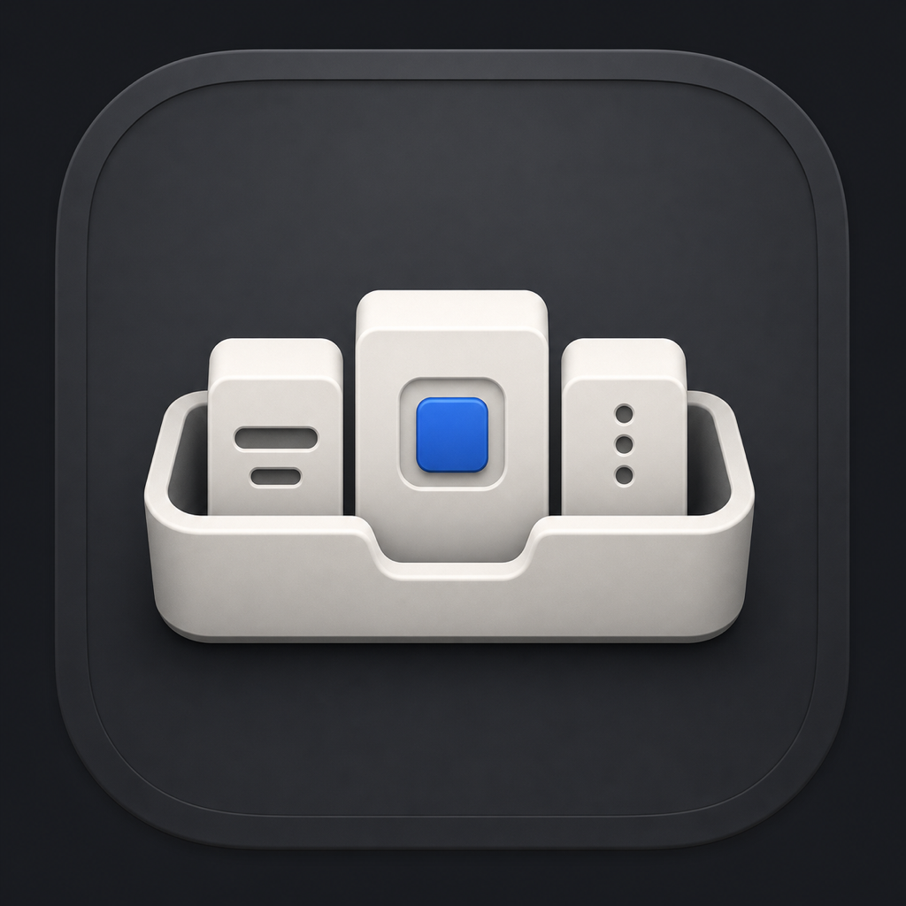

# Workbench 🧰 — See what Codex is really doing.

> 把 Codex 的 Skills、Hooks、Memory 和 MCP，放到一个看得懂的窗口里。

[](https://github.com/fslot2601-source/workbench/releases/latest)
[](https://github.com/fslot2601-source/workbench/releases/latest)
[](https://github.com/fslot2601-source/workbench/actions/workflows/ci.yml)
[](LICENSE)



Workbench 是一款原生 macOS 应用，用来查看和管理本机 Codex 的能力与状态。它会告诉你 Skill 是隐式、显式还是隐藏，Hook 在什么时候触发，MCP 实际暴露了哪些工具，Memory 记住了什么，以及当前用量和本机存储占用了多少空间。

所有内容都来自本机 Codex、当前配置和实际运行结果。没有独立账户，没有遥测，也不需要把配置交给另一个云服务。

## Why

- **看清真实状态。** 写进配置、开关已启用、服务已连接、能力可以使用，是几个不同阶段。Workbench 会把它们分开显示。
- **知道这些东西是做什么的。** Skills、Hooks、MCP 和 Memory 都会补上中文说明、来源和作用范围，不用自己翻配置文件。
- **需要时再动手。** 常用开关可以直接调整；不适合由界面擅自处理的内容，例如 Memory，仍然交给你和 Codex 决定。
- **少一点猜测。** Codex 没有提供的数据不会被补成一个看起来很完整的数字。无法验证时，界面会直接写“待确认”或“未验证”。

## Install

### Requirements

- macOS 14 或更高版本
- 本机已经安装并登录 ChatGPT 桌面版，或已单独安装 Codex CLI

### GitHub Releases

下载：[Workbench 最新版本](https://github.com/fslot2601-source/workbench/releases/latest)

打开 DMG，把 Workbench 拖进“应用程序”即可。

### First run

目前发布的是未签名社区版本。第一次启动时：

1. 在 Finder 中找到 Workbench。
2. 右键选择“打开”。
3. 如果仍被 macOS 拦截，前往“系统设置 → 隐私与安全性”，选择“仍要打开”。

## What it shows

- **Skills** — 用途、来源、依赖、错误，以及隐式、显式、隐藏三种调用状态。
- **Hooks** — 触发时机、处理器、执行顺序、信任状态和当前连接观察到的运行记录。
- **MCP** — 配置开关、启动与连接阶段、工具、资源和资源模板。
- **Memory** — Codex 记住的内容、来源、更新时间、相关项目和当前适用范围。
- **Usage** — Codex 返回的限额、重置时间、Token 汇总和每日趋势。
- **Storage** — Codex Home 分类占用，以及缓存、临时文件、日志和归档会话的分级清理。
- **Backup** — 通过本机 GitHub CLI 备份脱敏后的配置，并从私人仓库读取备份记录。
- **Menu bar** — 不打开主窗口也能快速查看用量、存储和自检状态。
- **Self-check** — 检查 Codex、工作区、Skills、Hooks、MCP、Memory、存储和备份是否正常。

## What the status means

Workbench 不把“配置已启用”写成“已经在某次任务中运行”。

MCP 只有实际返回能力清单后，才会显示工具与资源已经读取。Hook 的运行记录只来自 Workbench 当前连接的 Codex App Server，不代表其他 Codex 客户端的全局历史。Memory 页面负责阅读和解释，不直接改写 Codex 生成的 Memory 文件。

## Privacy

- 不包含遥测、广告或独立账户系统。
- 不读取或保存 Codex 登录令牌。
- GitHub 认证由 GitHub CLI 和 macOS 钥匙串处理，Workbench 不接触 GitHub token。
- Memory 默认只读，进入界面的内容会经过限制和脱敏；raw 与 Chronicle 不进入主记忆列表。
- MCP 参数、环境变量、查询字符串和工具 schema 不会显示在界面中。
- 存储清理仅限当前 Codex Home 下的固定白名单。缓存可以重建，临时文件与日志移入废纸篓，归档会话需要单独确认。
- 缓存清理不是安全擦除，不能用来销毁敏感数据。

Workbench 需要启动本机 Codex 并访问用户选择的工作区，因此当前构建不启用 App Sandbox。Release 构建启用了 Hardened Runtime，但未使用 Developer ID 签名，也没有经过 Apple 公证。

## Build from source

需要 Xcode 16、Swift 6 和 XcodeGen。

```bash
xcodegen generate
xcodebuild -project SkillLens.xcodeproj -scheme SkillLens -configuration Debug -destination 'platform=macOS' build
```

也可以直接用 Xcode 打开 `SkillLens.xcodeproj`。应用不会捆绑 Codex；首次启动会优先查找 `ChatGPT.app` 内置的 Codex，也兼容旧版 `Codex.app`、独立安装位置和 `PATH`。找不到时，可以在设置中直接选择应用或 `codex` 可执行文件。

运行测试：

```bash
xcodebuild -project SkillLens.xcodeproj -scheme SkillLens -configuration Debug \
  -destination 'platform=macOS' -only-testing:SkillLensTests test
```

## Build a release

```bash
./scripts/build-release.sh
```

脚本会生成通用架构的 ZIP、DMG 和 SHA-256 校验文件，并检查两个安装包中的应用版本、架构和内容是否一致。没有 Developer ID 时，产物会明确标记为未签名社区构建。

完整流程见 [发布清单](docs/RELEASE_CHECKLIST.md)。

## Docs

- [开发路线](ROADMAP.md)
- [执行边界与兼容策略](docs/EXECUTION_PLAN.md)
- [发布清单](docs/RELEASE_CHECKLIST.md)
- [版本记录](CHANGELOG.md)
- [参与贡献](CONTRIBUTING.md)
- [安全说明](SECURITY.md)

## License

MIT。Workbench 是独立开源项目，与 OpenAI 无隶属或官方授权关系。
